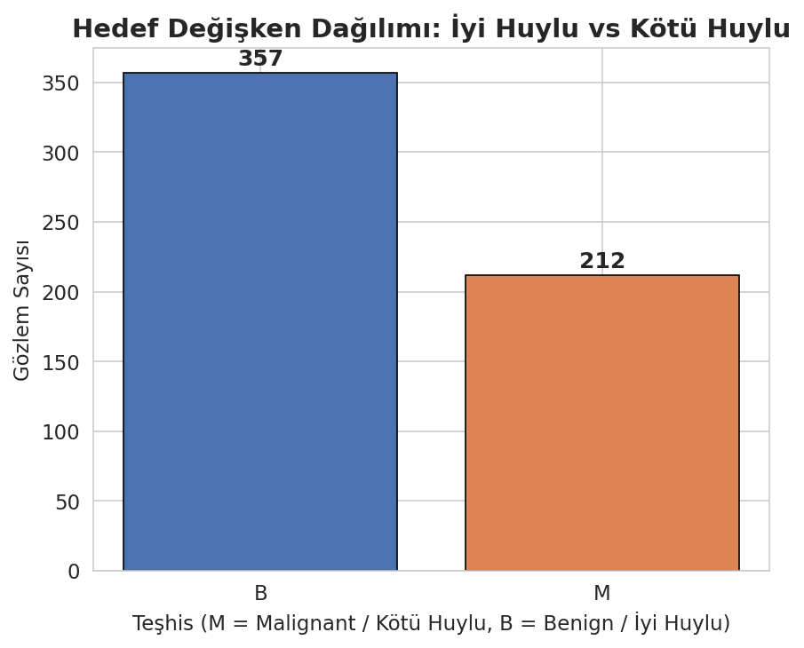
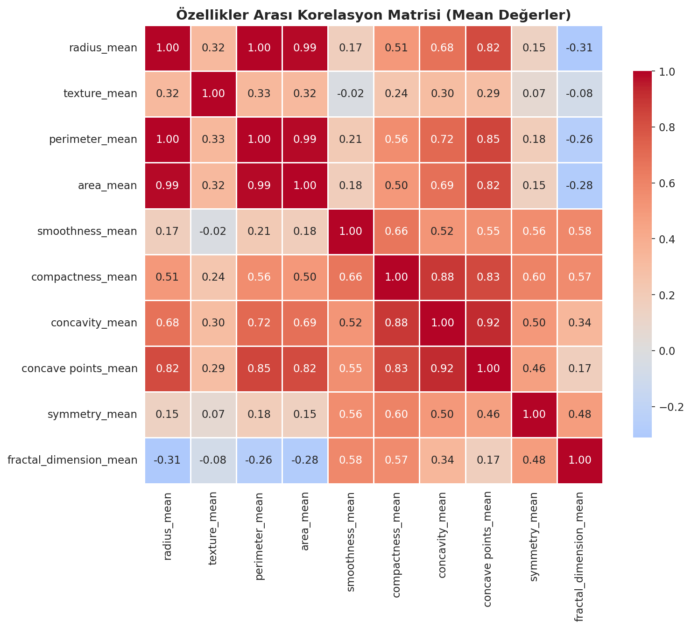
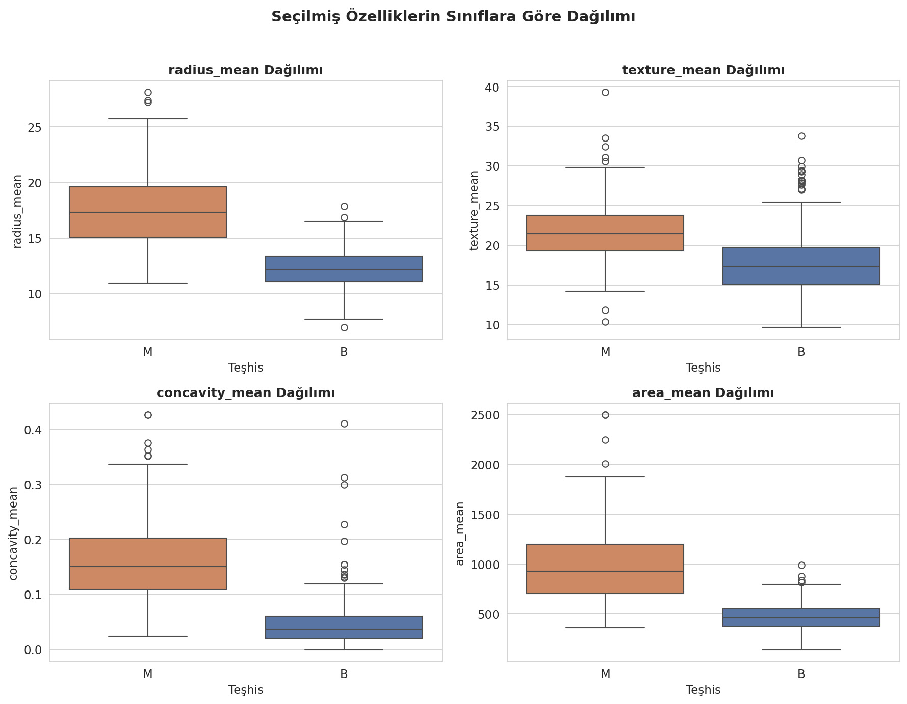
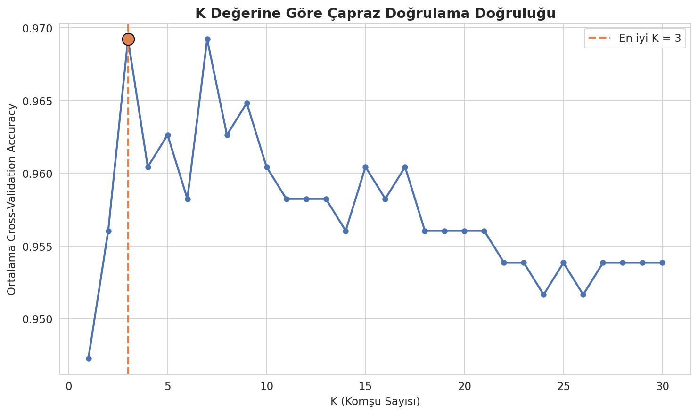
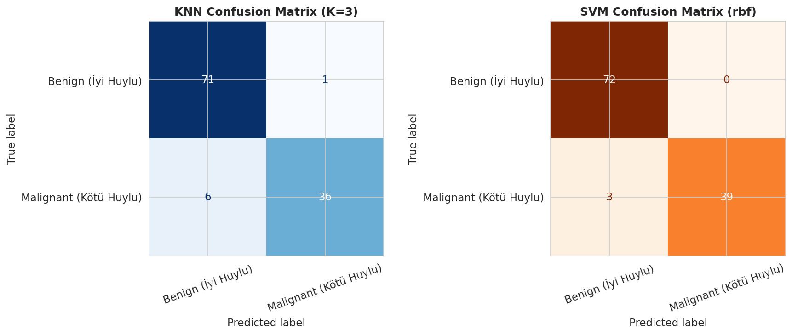
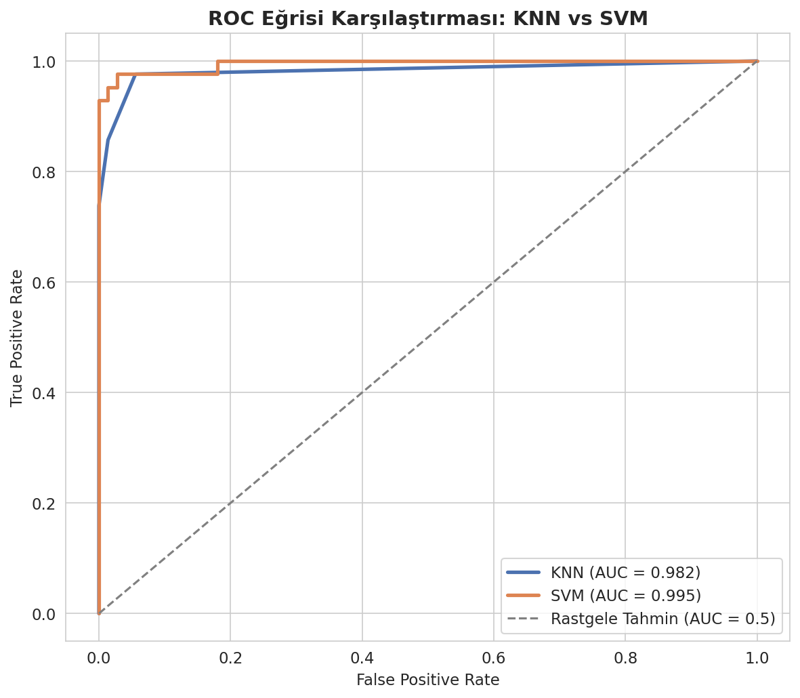
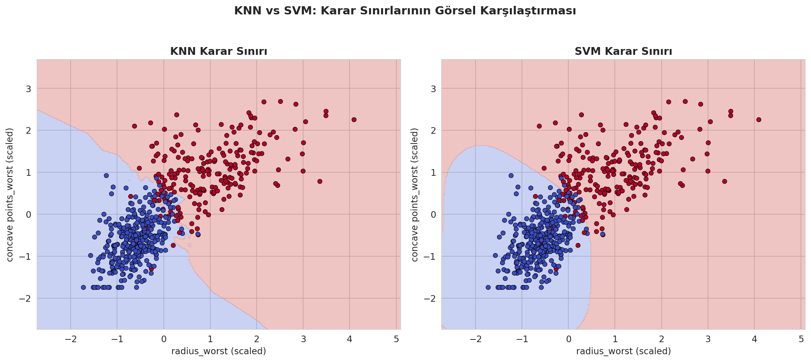

# 🩺 Breast Cancer Diagnosis Prediction: KNN vs SVM Classification
 
**Huawei Student Developers & Türkiye Yapay Zeka Akademisi — Data Science & Machine Learning Bootcamp Final Project**
 
A comparative machine learning study predicting whether a breast tumor is **benign** or **malignant** based on cell nuclei measurements, using **K-Nearest Neighbors (KNN)** and **Support Vector Machines (SVM)**, with full hyperparameter tuning and detailed performance evaluation.
 
---
 
## 📖 Full Write-Up
 
For the complete, detailed walkthrough of this project — including explanations, methodology, and interpretation of every result — check out the Medium article:
 
📝 **[Read the full article on Medium](https://medium.com/@serdararici/meme-kanseri-te%C5%9Fhisinde-makine-%C3%B6%C4%9Frenmesi-knn-ve-svm-algoritmalar%C4%B1n%C4%B1n-kar%C5%9F%C4%B1la%C5%9Ft%C4%B1rmal%C4%B1-analizi-cc79afc31853)** *(Turkish)*
 
## 🔗 Project Links
 
| Resource | Link |
|---|---|
| 📓 Google Colab Notebook | [Open in Colab](https://colab.research.google.com/drive/1tr6S3Fj7iEpq1W_YqIS65y7JJ1jzooCN?usp=sharing) |
| 📊 Kaggle Notebook | [View on Kaggle](https://www.kaggle.com/code/serdararici/breast-cancer-knn-svm-classification) |
| 📁 Dataset | [Breast Cancer Wisconsin (Diagnostic) — Kaggle](https://www.kaggle.com/datasets/uciml/breast-cancer-wisconsin-data) |
| 📝 Medium Article | [Full write-up (Turkish)](https://medium.com/@serdararici/meme-kanseri-te%C5%9Fhisinde-makine-%C3%B6%C4%9Frenmesi-knn-ve-svm-algoritmalar%C4%B1n%C4%B1n-kar%C5%9F%C4%B1la%C5%9Ft%C4%B1rmal%C4%B1-analizi-cc79afc31853) |
 
---
 
## 🎯 Project Objective
 
This project addresses a real-world binary classification problem: **can we predict whether a breast tumor is benign or malignant based on measurements taken from cell nuclei?**
 
Beyond building an accurate model, the goals were to:
- Compare how two fundamentally different algorithm families (distance-based KNN vs. margin-based SVM) behave on the same problem
- Demonstrate the concrete impact of hyperparameter tuning on model performance
- Highlight why accuracy alone is insufficient in sensitive domains like healthcare, and why precision/recall matter
## 📊 Dataset
 
- **Source:** [Breast Cancer Wisconsin (Diagnostic) Data Set](https://www.kaggle.com/datasets/uciml/breast-cancer-wisconsin-data) (Kaggle / UCI Machine Learning Repository)
- **Observations:** 569 patients
- **Features:** 30 numerical features derived from digitized images of breast mass cell nuclei (radius, texture, perimeter, area, smoothness, compactness, concavity, concave points, symmetry, fractal dimension — each summarized by mean, standard error, and worst value)
- **Target:** `diagnosis` — **M** (Malignant) or **B** (Benign)
## 🛠️ Methodology
 
1. **Data Loading & Cleaning** — removed non-informative columns (`id`, empty artifact column)
2. **Exploratory Data Analysis (EDA)** — class distribution, correlation analysis, feature distributions by class
3. **Preprocessing** — train/test split (80/20, stratified), feature scaling with `StandardScaler`
4. **Model 1: KNN** — hyperparameter tuning (K = 1 to 30) via 5-fold cross-validation
5. **Model 2: SVM** — hyperparameter tuning (`C`, `kernel`, `gamma`) via `GridSearchCV`
6. **Evaluation** — accuracy, precision, recall, F1-score, confusion matrix, ROC-AUC, and 2D decision boundary visualization
## 📈 Results
 
| Model | Accuracy | Precision | Recall | F1-Score | AUC |
|---|---|---|---|---|---|
| KNN (K=3) | 93.9% | 97.3% | 85.7% | 0.911 | 0.982 |
| **SVM (rbf, C=1)** | **97.4%** | **100.0%** | **92.9%** | **0.963** | **0.995** |
 
**SVM outperformed KNN across every metric.** The most clinically relevant difference is in **recall**: out of 42 malignant cases in the test set, KNN missed 6 while SVM missed only 3 — a meaningful difference when false negatives carry real clinical consequences.
 
### Key Visualizations
 
<table>
<tr>
<td></td>
<td></td>
</tr>
<tr>
<td></td>
<td></td>
</tr>
<tr>
<td></td>
<td></td>
</tr>
<tr>
<td colspan="2" align="center"></td>
</tr>
</table>
## 🔍 Key Takeaways
 
- **Feature scaling is essential** for distance/margin-based algorithms like KNN and SVM — features in this dataset span vastly different numerical ranges (e.g. `area_mean` in the hundreds vs. `smoothness_mean` between 0–1).
- **Hyperparameter tuning matters.** Testing all K values from 1–30 for KNN, and running `GridSearchCV` for SVM, produced measurably better cross-validation performance than default settings.
- **No single algorithm is universally "best."** SVM (rbf kernel) outperformed KNN here because the class boundary had a mildly non-linear structure — a different dataset could favor a different algorithm.
- **Accuracy alone is not enough**, especially in healthcare contexts. The confusion matrix translated a seemingly small accuracy gap (93.9% vs 97.4%) into a concrete, meaningful difference: 3 fewer missed malignant cases.
## 🚀 Possible Extensions
 
- Add ensemble methods (Random Forest, Gradient Boosting) to the comparison
- Apply feature selection to reduce dimensionality while preserving performance
- Test generalizability on data from different hospitals/populations
- Add model explainability (SHAP, LIME) for individual prediction interpretation
## 🧰 Tech Stack
 
`Python` · `pandas` · `NumPy` · `scikit-learn` · `matplotlib` · `seaborn`
 
## 👤 Author
 
**Serdar Arıcı**
Computer Engineering (BSc, Sakarya University) · Computer Engineering (MSc, in progress, Sakarya University)
 
---
 
*This project was developed as the final project for the Huawei Student Developers × Türkiye Yapay Zeka Akademisi Data Science & Machine Learning Bootcamp.*
